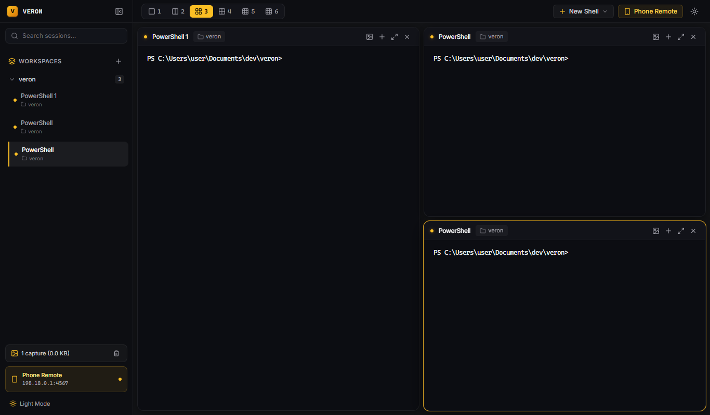
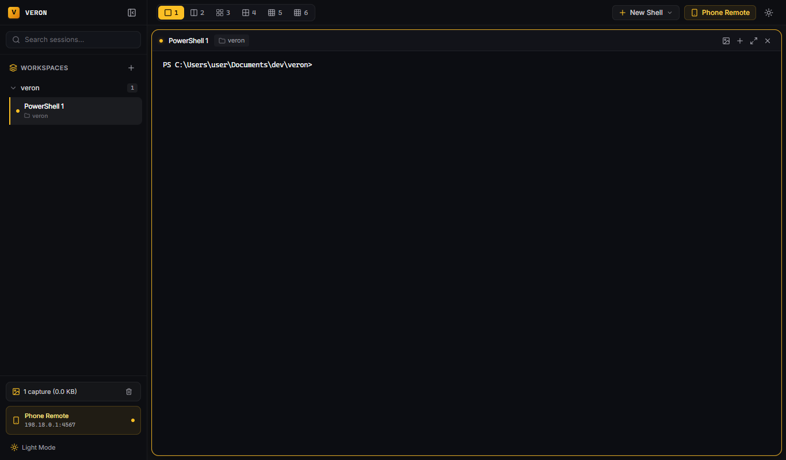
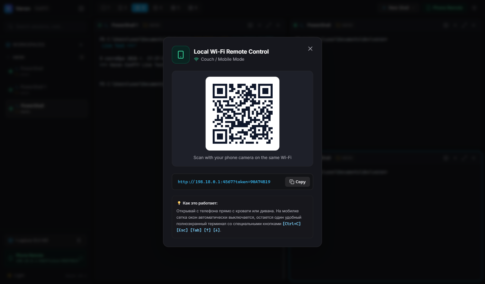
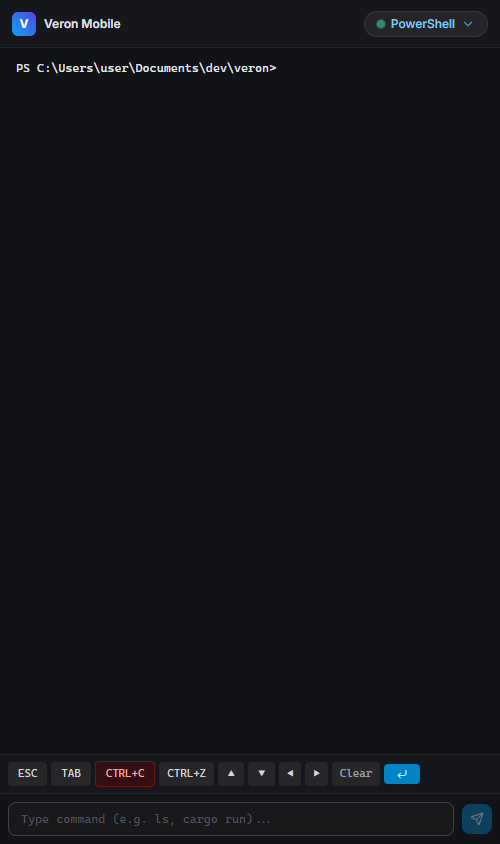

# Veron ⚡

<p align="center">
  
</p>

<p align="center">
  <strong>Сверхбыстрый, автономный десктопный терминальный мультиплексор и оркестратор AI-агентов для Windows.</strong><br>
  Разработан на Rust (Tao + Wry + ConPTY) с эстетикой уровня Apple, без «нейрослопа» и без навязанной телеметрии.
</p>

<p align="center">
  
  
  
  
  <a href="LICENSE"></a>
</p>

<p align="center">
  <a href="README.md"><b>English</b></a> • <a href="README.ru.md"><b>Русский</b></a>
</p>

---

<p align="center">
  
</p>

---

## ⚡ Почему Veron?

Большинство современных терминальных мультиплексоров либо перегружены облачными функциями и телеметрией, либо собраны на тяжелых фреймворках, съедающих сотни мегабайт оперативной памяти.

**Veron** предлагает легкую, автономную среду для Windows, созданную специально для скоростной парной разработки с AI-агентами (Google Antigravity, Claude Code, Codex CLI) и параллельного запуска десятков рабочих процессов:

- **Единый автономный `.exe` (~3.7 МБ)**: Весь веб-фронтенд (HTML, CSS, JS, XTerm, шрифты) вшит прямо в бинарник через `rust-embed`. Никаких установщиков, внешних рантаймов и скрытых зависимостей.
- **Чистая производительность ConPTY**: Прямая интеграция с Windows Pseudo-Terminals (`portable-pty`) для мгновенного запуска PowerShell, CMD, Git Bash и WSL с нулевыми задержками.
- **Гарантия завершения процессов (Zero Zombies)**: Рекурсивное глубинное удаление дерева процессов (`taskkill /PID <pid> /T /F`) мгновенно зачищает все порожденные серверы (`node`, `vite`, `python`, `cargo`) при закрытии панели или программы.
- **Отказоустойчивый кольцевой буфер истории на 512 КБ**: Вывод терминала сохраняется в памяти в кольцевом буфере $O(1)$ (`VecDeque<u8>`). Данные не теряются при ресайзе окон, смене вкладок или переподключении со смартфона.
- **14 дизайнерских тем оформления**: От фирменной *Cybran Amber* (обсидиан и янтарное золото) до *Emerald Matrix*, *Cobalt Cyan*, *Monokai Neon* и чистых светлых тем, с возможностью ручной калибровки цвета через HEX / пипетку.

---

## 🌟 Ключевые возможности

### 1. Сетка терминалов (от 1 до 6 окон) со Slot Persistence
- **Сегментированный переключатель сеток (1–6)**:
  - `1`: Одиночный полноэкранный терминал.
  - `2`: Сплит 50/50 из двух колонок.
  - `3`: 1 главное окно слева + 2 окна стопкой справа (стиль BridgeMind).
  - `4`: Классическая сетка 2×2.
  - `5`: 2 окна сверху + 3 окна снизу.
  - `6`: Сетка 2×3 (6 независимых параллельных сессий).
- **Slot Persistence**: Закрытие или изменение одного окна не сдвигает соседние терминалы.
- **Моментальный сплит (`Ctrl+Shift+T` / `Ctrl+Shift+D`)**: Мгновенно открывает новый шелл и расширяет сетку без кликов мыши.
- **Переименование по двойному клику**: Дабл-клик по названию сессии позволяет дать ей осмысленное имя (`Vite Dev`, `Docker DB`, `AI Agent`).

<p align="center">
  
</p>

### 2. Интерактивные сплиттеры с нулевым лагом и Drag-and-Drop окон
- **Динамические разделители (Splitters)**: Плавный ресайз колонок и строк во всех раскладках 2–6 окон.
- **Абсолютный геометрический трекинг**: Прямой расчет координат курсора устраняет эффект «магнитного отката» и задержки анимации.
- **Индикация при наведении**: Разделители незаметны в обычном состоянии и мягко подсвечиваются янтарной ручкой при ховере. Двойной клик мгновенно сбрасывает пропорции к ровным (50/50, 33/33/33).
- **Перетаскивание окон (Drag-and-Drop)**: Захват заголовка панели позволяет поменять терминалы местами. Полупрозрачная миниатюра-карточка под курсором показывает точку вставки, не прерывая запущенные процессы.

### 3. Движок тем оформления и ручная калибровка цвета
- **14 готовых пресетов**:
  - **10 индустриальных темных палитр**: *Cybran Amber* (культовый обсидиан и янтарь), *Emerald Matrix*, *Cobalt Cyan*, *Amethyst Synth*, *Crimson Void*, *Solar Gold*, *Velvet Rose*, *Nordic Frost*, *Monokai Neon*, *Titanium Slate*.
  - **4 светлые темы**: *Paper Amber*, *Paper Cobalt*, *Paper Emerald*, *Paper Minimal*.
- **Ручная настройка цвета**: Выбор любого оттенка через встроенный Color Picker или ввод `#HEX` с автоматическим расчетом контрастного цвета шрифта.
- **Бесшовное применение**: Цвета обновляются в `@xterm/xterm` на лету без перезапуска шелла и сброса сессий.

### 4. Воркспейсы и синергия с AI-агентом Antigravity (AGY)
- **Изоляция групп воркспейсов**: Группировка до 6 терминалов в независимые пространства со своими директориями, раскладками и шеллами.
- **Автозапуск Antigravity**: Создание воркспейса Antigravity автоматически запускает команду `agy` и отображает фирменную векторную эмблему.
- **Детектор состояния "Needs Input"**: Система отслеживает буфер терминала и сигнализирует пульсирующим бейджем, когда агент ждет подтверждения от разработчика.
- **Кнопка запуска в пустых слотах**: Незанятые квадранты AGY-воркспейса выводят стилизованную карточку быстрого запуска нового агента.

### 5. Изоляция веток Git Worktree и встроенный Diff-инспектор
- **Изолированные деревья Git**: Создание рабочих пространств на базе изолированных Git Worktree (`.veron/worktrees/<branch>`) защищает основную ветку репозитория от случайных поломок.
- **Плашка Live Git Diff**: В хедере приложения в реальном времени отображается ветка и баланс строк (`[ main +42 -12]`).
- **Модальное окно инспекции Diff**: Клик по плашке открывает окно с перечнем измененных файлов, подсветкой unified diff и синтетическим diff для неотслеживаемых (untracked) файлов.

### 6. Win32 Port Scanner и открытие серверов в 1 клик
- **Сетевой сканер без дочерних процессов**: Прямое обращение к Win32 `GetExtendedTcpTable` определяет открытые TCP-порты дочерних процессов ConPTY за 11 мс без нагрузки на CPU.
- **Индикатор активных портов**: При старте dev-сервера (Vite, Next.js, Python, Cargo) в шапке зажигается плашка `[● :5173 ↗]`.
- **Безопасное открытие в браузере**: Вызов системного браузера через Win32 `ShellExecuteW` без промежуточных `cmd.exe`.

### 7. 4-уровневый буфер обмена Windows и перехват скриншотов
- **Вставка на любой раскладке (`Ctrl+V` / `Win+V`)**: Синхронный захват жеста пользователя обеспечивает стабильную вставку на русской, английской и международных раскладках.
- **Copy-on-Select и Enter-to-Copy**: Автоматическое копирование выделенного текста в буфер при отпускании мыши или нажатии Enter.
- **Пайплайн скриншотов**: Нажатие `Ctrl+V` с изображением в буфере или drag-and-drop картинки сохраняет файл в `.veron/captures/` и подставляет относительный путь в командную строку.
- **AGY Mode**: В пространствах агента изображения прикрепляются как нативные медиа-файлы без засорения текстового поля ввода.

### 8. Мобильный «Диванный режим» (Wi-Fi LAN)
- **Доступ по локальной сети**: Подключение с телефона или планшета по адресу `http://<LAN-IP>:4567?token=...`.
- **Авторизация по QR-коду и PIN**: Безопасный доступ через модальное окно QR-кода.
- **Тач-бар разработчика**: Одиночный полноэкранный терминал с виртуальными кнопками `[ESC]`, `[TAB]`, `[CTRL+C]`, `[CTRL+Z]`, стрелками `[▲] [▼] [◀] [▶]` и адаптацией под клавиатуру смартфона.

<p align="center">
  &nbsp;&nbsp;&nbsp;&nbsp;
  
</p>

### 9. Палитра команд и скриптов (`Ctrl+K` / `⌘K`)
- **Готовые системные пресеты**:
  - **Система**: Очистка зависших портов, мониторинг тяжелых процессов, сетевая диагностика.
  - **Git**: `git status -s`, `git pull`, граф коммитов, краткий diff.
  - **Dev**: Быстрая сборка, запуск тестов, очистка папки скриншотов.
- **Свои команды**: Добавление кастомных скриптов с сохранением в `localStorage` и возможностью мгновенного исполнения по Enter.

---

## ⌨️ Таблица горячих клавиш

| Комбинация | Действие |
| :--- | :--- |
| `Alt + 1` … `Alt + 6` | Мгновенный фокус на терминал в слотах с 1 по 6 |
| `Alt + M` | Развернуть активное окно на весь экран / вернуть сетку |
| `Alt + W` | Закрыть сессию в активном слоте |
| `Ctrl + Shift + T` / `Ctrl + Shift + D` | Быстрый сплит: запустить новый шелл и адаптировать сетку |
| `Ctrl + K` | Открыть командную палитру быстрых скриптов |
| `Ctrl + C` | Копировать (если текст выделен) или отправить `SIGINT` (если нет выделения) |
| `Ctrl + V` | Универсальная вставка (текст, изображения, история `Win+V`) |
| `Ctrl + Enter` / `Shift + Enter` | Перенос строки (`\n`) для ввода многострочных промптов в AI-агентах |
| `Escape` | Закрыть открытые модальные окна (Настройки, Diff, Скрипты, QR) |

---

## 🚀 Как запускать
 
### Вариант 1: Запуск десктопного приложения (1 клик)
Просто запусти файл:
```powershell
.\veron.exe
```
*(Или собери из исходников по инструкции ниже)*

### Вариант 2: Запуск в режиме сервера (Headless / без GUI-окна)
Для работы в фоне и доступа только через браузер или мобильный телефон:
```powershell
.\veron.exe --server-only --port 4567 --token mysecrettoken
```

#### Параметры командной строки
| Флаг | Описание | Значение по умолчанию |
| :--- | :--- | :--- |
| `-p`, `--port <PORT>` | Порт HTTP и WebSocket сервера | `4567` |
| `-t`, `--token <TOKEN>` | Секретный токен авторизации (или `VERON_TOKEN`) | Случайный 8-значный токен |
| `--server-only`, `--headless`, `-d` | Запуск сервера в фоне без открытия окна GUI | `false` |
| `-h`, `--help` | Показать справку по параметрам CLI | — |

---

## 🛠️ Сборка из исходников

### Требования
- **ОС**: Windows 10/11 (64-bit)
- **Rust**: 1.80+ (`rustup default stable`)
- **Node.js**: 20+ и `npm`

### Пошаговая инструкция
```powershell
# 1. Клонирование репозитория
git clone https://github.com/T58574/1xveron.git
cd 1xveron

# 2. Установка зависимостей фронтенда
npm install

# 3. Сборка фронтенда (создает папку dist/)
npm run build

# 4. Компиляция оптимизированного бинарника на Rust
cargo build --release --manifest-path src-tauri/Cargo.toml

# 5. Запуск готового Veron
.\src-tauri\target\release\veron.exe
```

---

## 🏗️ Архитектура и стек технологий

```
veron/
├── public/                 # Статические веб-ассеты (векторная иконка veron-icon.svg)
├── docs/screenshots/       # Скриншоты и медиа-материалы для документации
├── src/                    # React 18 Фронтенд
│   ├── App.tsx             # Оркестратор сетки окон и разделителей
│   ├── components/         # TerminalPane, Sidebar, TopBar, PaneSplitter, Модалки
│   └── services/           # Клиент REST API, WebSocket, Движок тем оформления
└── src-tauri/              # Rust Нативный Бэкенд
    └── src/
        ├── main.rs         # Цикл событий Tao и обработчик CLI-флагов
        ├── server.rs       # Axum HTTP/WS сервер и Token Guard
        ├── session.rs      # SessionManager и кольцевой буфер O(1) 512 КБ
        ├── pty.rs          # ConPTY ядро и глубинная зачистка процессов
        ├── ports.rs        # Сетевой сканер портов Win32 ExtendedTcpTable
        ├── git.rs          # Git Worktree и движок генерации unified diff
        └── clipboard.rs    # Нативный Win32 Clipboard API
```

| Слой | Технологии |
| :--- | :--- |
| **Десктопная оболочка** | `tao 0.37` (Окно и цикл событий) + `wry 0.57` (WebView2) |
| **Ядро бэкенда** | Rust 2021, `tokio 1.40`, `axum 0.7`, `tower-http 0.6` |
| **Терминальная подсистема** | `portable-pty 0.8` (ConPTY), `VecDeque<u8>` кольцевой буфер |
| **Фронтенд** | React 18, TypeScript 5.6, Vite 5, Tailwind CSS |
| **Эмулятор терминала** | `@xterm/xterm 5.5`, `@xterm/addon-fit`, `@xterm/addon-webgl` |
| **Сетевой сканер** | Win32 API (`iphlpapi.dll` / `GetExtendedTcpTable`) |

---

## 🤝 Вклад в проект

Пулл-реквесты приветствуются! Ознакомься с файлом [CONTRIBUTING.md](CONTRIBUTING.md) для соблюдения архитектурных инвариантов проекта.

---

## 📄 Лицензия

Veron распространяется под лицензией **[MIT](LICENSE)**.
Разработано с заботой о высокой продуктивности и автономности инженеров.
